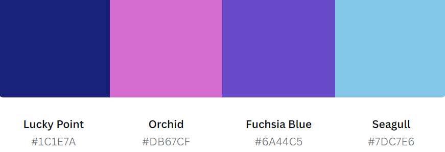
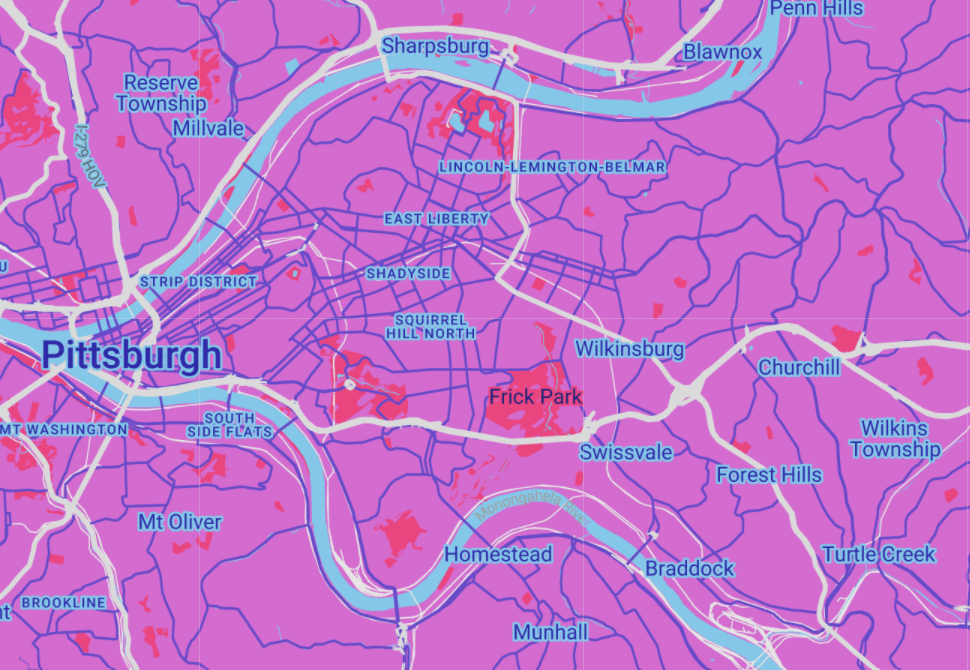
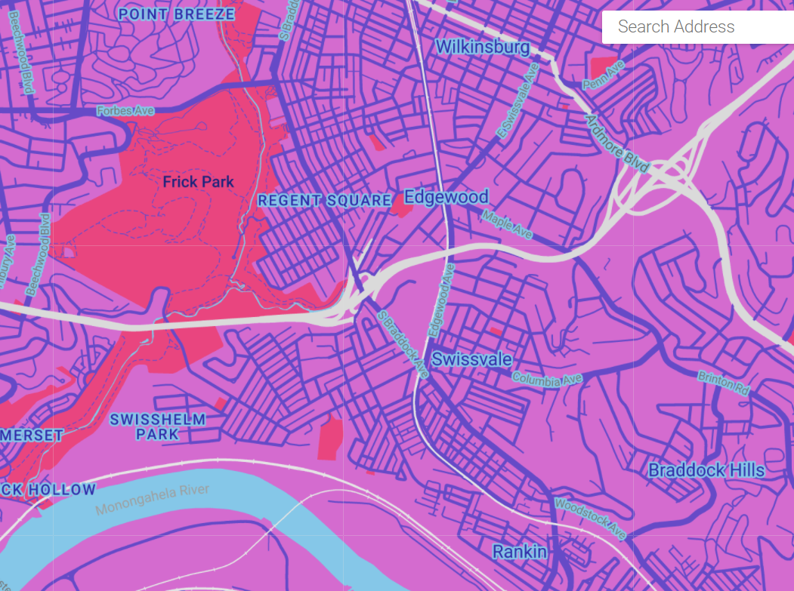
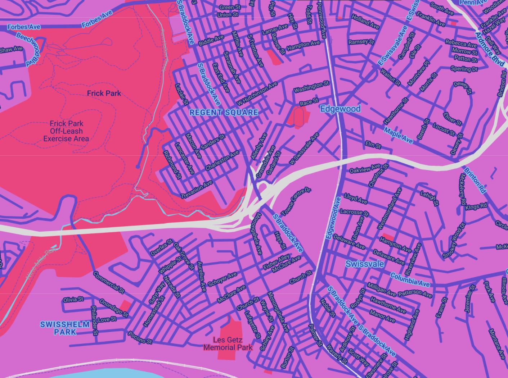

## Homework 1: Custom Google Map for Peoples Pride by sisTersPGH

### Background
SisTersPGH is a non-profit organization based in Swissvale, Pennsylvania. The organization advocates for equal rights and equal treatment of LGBTQIA+ peoples in southwestern PA. One of their flagship programs, The People's Pride, is an annual celebration of local nonprofits, school districts, unions, and community members, and serves as a people-based competitor to "traditional" corporate-sponsored Pride parades. Until this year, People's Pride was located in Pittsburgh, PA. However, this year the parade is in Swissvale, PA, and marks the first time ever the Borough has a pride parade. 

### SisTersPGH People's Pride 2022 Poster

#### Canva Color Palette

#### Adobe Color Palette

### Process
The first thing I did was download the official SisTersPGH People's Pride 2022: Swissvale Pride poster, then I uploaded it into Canva palette maker and Adobe's palette maker. This produced a total of eight colors to use for the map.

For the basemap color, I opted for a light pink to match the person on the poster. Then, I used the purples and navy to create contrast for the various aspects of the map including roads, bodies of water, labels and borders for countries, states, and municipalities. For parks, I used a darker pink so it would still be visible when compared to the basemap, but is clearly separate from the bodies of water.

High contrast labels are especially important for the smaller, municipal-level streets. Since the event is a parade and festival, there will be several points of interest such as the start and end of the parade route, and festival location. Easily readable street names are vital for participants to know exactly where the event takes place

#### Large extent map

#### Medium extent map

#### Parade extent map

### JSON Code
[
  {
    "elementType": "geometry",
    "stylers": [
      {
        "color": "#db67cf"
      }
    ]
  },
  {
    "elementType": "labels.icon",
    "stylers": [
      {
        "visibility": "off"
      }
    ]
  },
  {
    "elementType": "labels.text.fill",
    "stylers": [
      {
        "color": "#3321a6"
      }
    ]
  },
  {
    "elementType": "labels.text.stroke",
    "stylers": [
      {
        "color": "#7dc7e6"
      }
    ]
  },
  {
    "featureType": "administrative.country",
    "elementType": "geometry",
    "stylers": [
      {
        "color": "#091973"
      }
    ]
  },
  {
    "featureType": "administrative.land_parcel",
    "elementType": "labels.text.fill",
    "stylers": [
      {
        "color": "#1c1e7a"
      }
    ]
  },
  {
    "featureType": "administrative.province",
    "elementType": "geometry.stroke",
    "stylers": [
      {
        "color": "#091973"
      }
    ]
  },
  {
    "featureType": "landscape.man_made",
    "elementType": "geometry.stroke",
    "stylers": [
      {
        "color": "#1c1e7a"
      }
    ]
  },
  {
    "featureType": "landscape.natural",
    "elementType": "geometry.stroke",
    "stylers": [
      {
        "color": "#1c1e7a"
      }
    ]
  },
  {
    "featureType": "poi",
    "elementType": "labels.text.fill",
    "stylers": [
      {
        "color": "#f24182"
      }
    ]
  },
  {
    "featureType": "poi",
    "elementType": "labels.text.stroke",
    "stylers": [
      {
        "color": "#f24182"
      }
    ]
  },
  {
    "featureType": "poi.park",
    "elementType": "geometry",
    "stylers": [
      {
        "color": "#f24182"
      }
    ]
  },
  {
    "featureType": "poi.park",
    "elementType": "labels.text.fill",
    "stylers": [
      {
        "color": "#9e9e9e"
      }
    ]
  },
  {
    "featureType": "road",
    "elementType": "geometry",
    "stylers": [
      {
        "color": "#6a44c5"
      }
    ]
  },
  {
    "featureType": "road.arterial",
    "elementType": "labels.text.fill",
    "stylers": [
      {
        "color": "#757575"
      }
    ]
  },
  {
    "featureType": "road.highway",
    "elementType": "geometry",
    "stylers": [
      {
        "color": "#dadada"
      }
    ]
  },
  {
    "featureType": "road.highway",
    "elementType": "labels.text.fill",
    "stylers": [
      {
        "color": "#616161"
      }
    ]
  },
  {
    "featureType": "road.local",
    "elementType": "labels.text.fill",
    "stylers": [
      {
        "color": "#9e9e9e"
      }
    ]
  },
  {
    "featureType": "transit.line",
    "elementType": "geometry",
    "stylers": [
      {
        "color": "#e5e5e5"
      }
    ]
  },
  {
    "featureType": "transit.station",
    "elementType": "geometry",
    "stylers": [
      {
        "color": "#eeeeee"
      }
    ]
  },
  {
    "featureType": "water",
    "elementType": "geometry",
    "stylers": [
      {
        "color": "#7dc7e6"
      }
    ]
  },
  {
    "featureType": "water",
    "elementType": "labels.text.fill",
    "stylers": [
      {
        "color": "#9e9e9e"
      }
    ]
  }
]
